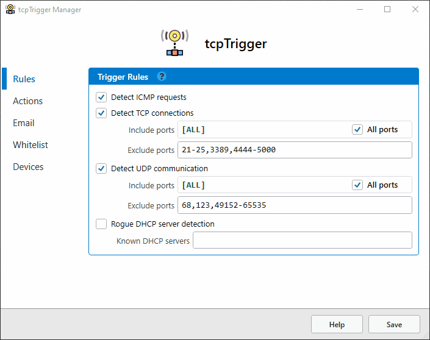

tcpTrigger
==========

tcpTrigger is a Windows service intended to notify you of incoming network connections. You specify what to monitor, and the actions to take when a connection is detected. Actions include: writing to a log, sending a notification email, and launching an external script or application.

##### Settings

